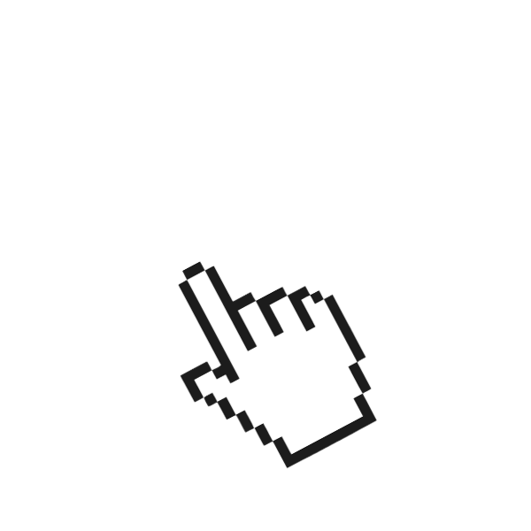

<link rel="stylesheet" href="index.css">

J7SŪS

[xeˈsus]

proper noun

1. Find creative solutions to technical challenges. 
2. Design systems and applications that are efficient, scalable, and user-friendly.

 

##
Hi, I'm J7sūs, a passionate Full-Stack Software Developer & aspiring Jedi. Years of experience have shaped my creative vision, which I apply to building robust and scalable applications. I thrive in team settings and enjoy the challenge of complex problems, bringing an innovative approach to development.  I'm a proactive problem-solver with a strong work ethic and a collaborative mindset.  I'm always eager to learn new technologies and contribute to innovative projects.  I believe clear communication and efficient teamwork are essential for project success.
| Web Technologies | Continuous Learning | Problem-Solving May the Code Be With You

## Tech Stack

## Connect with me

 </img>

